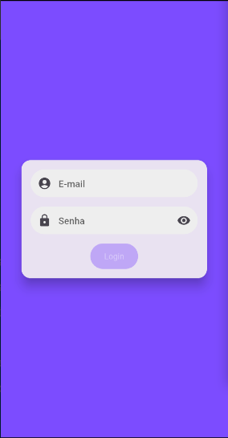
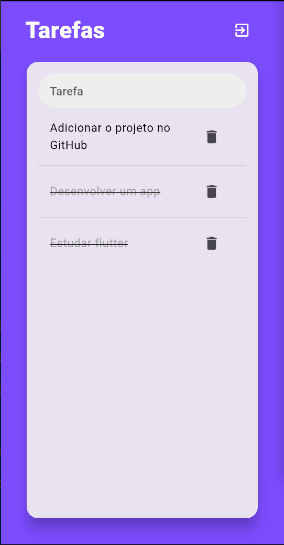

# todo_mobx

Projeto de uma lista de tarefas usando o gerenciador de estado mobx.

## Tecnologias

* Flutter
  * mobx
  * provider
  * mobx_codegen
  * flutter_mobx

## Imagens do app

### Tela de login

### Tela da lista de tarefas

